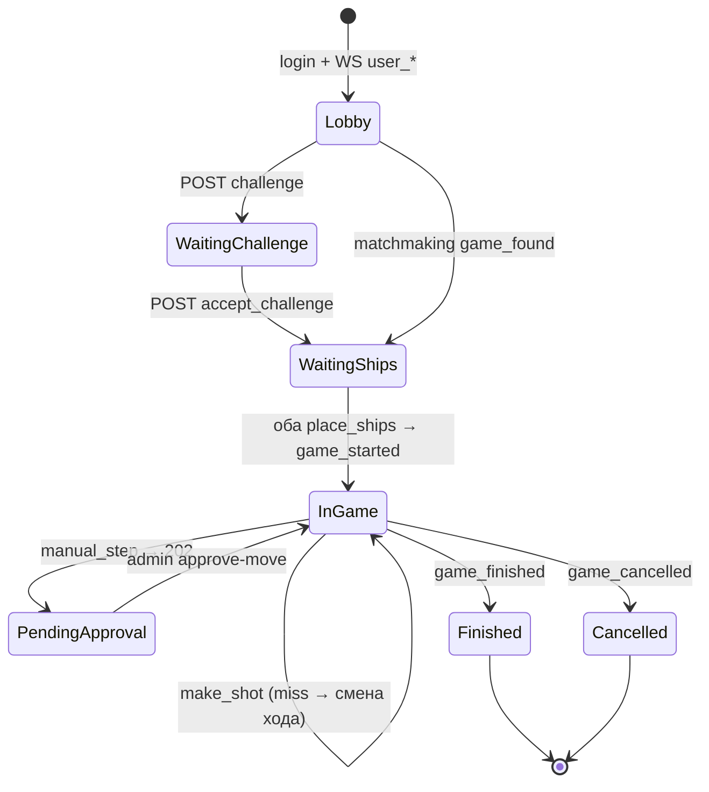

# WARSHIP — API для фронтенда

Документ для ИИ-агента / разработчика фронтенда. Описывает **все публичные HTTP-эндпоинты** и **real-time события Centrifugo**, необходимые для полной интеграции с бэкендом.

**Два клиента:**
- **Игровой UI** — `/api/`, `/api/warship/`
- **Admin-панель** (отдельный проект) — `/api/admin/`

---

## 0. Быстрый старт (что реализовать)

### Архитектура

```
Игровой фронтенд
  ├─ HTTP REST  →  /api/...           (логин, матчмейкинг, ходы)
  └─ WebSocket  →  Centrifugo :8001   (события: игра найдена, выстрел, конец игры)

Admin-панель
  ├─ HTTP REST  →  /api/admin/...     (группы, пользователи, статистика, управление играми)
  └─ WebSocket  →  Centrifugo :8001   (наблюдение за game_{id}, staff может подписаться на любую игру)
```

**Правило:** пользователь **инициирует действия через HTTP**, а **обновления UI получает через Centrifugo** (и при необходимости дублирует через HTTP polling `GET /status/` и `GET /board/`).

### Базовые URL (локальная разработка)

| Сервис | URL |
|--------|-----|
| REST API | `http://localhost:8000/api` |
| Admin REST API | `http://localhost:8000/api/admin` |
| Centrifugo WS | `ws://localhost:8001/connection/websocket` |

### Авторизация всех игровых запросов

```http
Authorization: Bearer <access_jwt>
Content-Type: application/json
```

JWT живёт **1 день** (`access`), refresh — **28 дней**. Обновление: `POST /api/auth/jwt/refresh/`.

**Забаненный пользователь** (`is_active=false`) не может логиниться и получает `401`/`403` на защищённых эндпоинтах.

### Минимальный порядок интеграции экранов (игровой UI)

1. **Регистрация / логин** → сохранить `access`, `refresh`, `user.id`
2. **Подключить Centrifugo** → `GET /api/warship/centrifugo/token/` → подписаться на `user_{user_id}`
3. **Лобби / матчмейкинг** → `POST /api/warship/matchmaking/find/`
4. **Экран игры** → подписаться на `game_{game_id}`, `POST place_ships`, цикл `GET board` + `POST make_shot`
5. **Выход** → `POST /api/warship/game/{id}/leave/` + отписаться от канала игры

### Минимальный порядок интеграции (admin-панель)

1. **Логин** пользователя с `is_staff=true` → `POST /api/auth/login/`
2. **Centrifugo** → `GET /api/admin/centrifugo/token/` → подписка на `game_{id}` активных партий
3. **Дашборд** → `GET /api/admin/stats/overview/`, `GET /api/admin/stats/games-by-day/`
4. **Группы / пользователи** → CRUD `/api/admin/groups/`, `/api/admin/users/`
5. **Наблюдение за игрой** → `GET /api/admin/games/{id}/board/`, `POST control/`, `POST approve-move/`

---

## 1. Аутентификация

### 1.1. Регистрация по телефону (OTP)

**Шаг 1 — запрос звонка / OTP**

```http
POST /api/auth/otp/request/
```

```json
{ "phone": "+79001234567" }
```

Ответ `200`:

```json
{
  "message": "На ваш номер поступит звонок. Введите последние 4 цифры номера.",
  "is_new_user": true
}
```

> Алиасы (обратная совместимость): `POST /api/auth/register/request-otp/`

**Шаг 2 — подтверждение OTP + установка пароля**

```http
POST /api/auth/otp/confirm/
```

```json
{
  "phone": "+79001234567",
  "code": "1234",
  "password": "secret123"
}
```

Ответ `201`:

```json
{
  "access": "<jwt>",
  "refresh": "<jwt>",
  "message": "Номер успешно привязан!",
  "user": { "id": 1, "phone": "+79001234567" }
}
```

> Алиас: `POST /api/auth/register/confirm-otp/`

### 1.2. Логин по паролю

```http
POST /api/auth/login/
```

```json
{
  "login": "+79001234567",
  "password": "secret123"
}
```

`login` — телефон **или** `username`.

Ответ `200`:

```json
{
  "access": "<jwt>",
  "refresh": "<jwt>",
  "user": { "id": 1, "phone": "+79001234567" }
}
```

Ошибка при бане: `400` `{ "non_field_errors": ["Пользователь деактивирован."] }`

### 1.3. Сброс пароля

**Запрос OTP:**

```http
POST /api/auth/password/reset/request/
```

```json
{ "phone": "+79001234567" }
```

**Подтверждение + новый пароль:**

```http
POST /api/auth/password/reset/confirm/
```

```json
{
  "phone": "+79001234567",
  "code": "1234",
  "password": "newsecret123"
}
```

### 1.4. Обновление JWT

```http
POST /api/auth/jwt/refresh/
```

```json
{ "refresh": "<refresh_jwt>" }
```

Ответ: `{ "access": "<new_access>" }` (формат simplejwt).

### 1.5. Логин бота (отдельный клиент, не основной UI)

```http
POST /api/auth/bot/login/
```

```json
{ "token": "<bot_uuid_token>" }
```

Ответ `200`:

```json
{
  "access": "<jwt>",
  "refresh": "<jwt>",
  "user_bot": { "id": 1, "name": "MyBot", "description": "..." }
}
```

**JWT claims бота:**
- `is_bot: true`
- `user_id` — ID **владельца** (человека)
- `user_bot_id` — ID конкретного `UserBot` (для per-bot рейтинга и привязки к игре)

**Ограничения бота:**
- Бот **не может** вызывать эндпоинты с `@deny_bot` (профиль, CRUD ботов).
- В матчмейкинге бот по умолчанию играет training-игры (`is_training: true` в теле запроса).
- При первом HTTP-запросе к игре бот автоматически привязывается к `GameSession.playerN_bot`.

---

## 2. Профиль пользователя

Все эндпоинты ниже требуют `Authorization: Bearer ...` и активного аккаунта (`is_active=true`).

### 2.1. Текущий пользователь

```http
GET /api/user/me/
```

Ответ `200`:

```json
{
  "id": 1,
  "phone": "+79001234567",
  "username": "+79001234567",
  "phone_pending": null,
  "first_name": "",
  "last_name": "",
  "email": ""
}
```

`phone_pending` — номер, ожидающий подтверждения OTP.

### 2.2. Обновление профиля

```http
PUT /api/user/me/
```

```json
{
  "username": "captain",
  "first_name": "Ivan",
  "last_name": "Petrov",
  "email": "a@b.c",
  "phone": "+79007654321",
  "password": "newpass"
}
```

Все поля опциональны (partial update). При смене `phone` отправляется OTP — нужен шаг 2.3.

> **Бот:** `403` — «Действие недоступно для бота».

### 2.3. Подтверждение нового телефона

```http
POST /api/user/me/confirm-phone/
```

```json
{ "code": "1234" }
```

---

## 3. Боты пользователя (CRUD)

Базовый путь: `/api/user/me/bots/`

| Метод | URL | Описание |
|-------|-----|----------|
| `GET` | `/api/user/me/bots/` | Список ботов |
| `GET` | `/api/user/me/bots/{id}/` | Один бот |
| `POST` | `/api/user/me/bots/` | Создать бота |
| `PUT` | `/api/user/me/bots/{id}/` | Обновить |
| `DELETE` | `/api/user/me/bots/{id}/` | Удалить |

**Создание:**

```http
POST /api/user/me/bots/
```

```json
{
  "name": "Alpha",
  "description": "Test bot"
}
```

Ответ `201`:

```json
{
  "id": 1,
  "name": "Alpha",
  "description": "Test bot",
  "token": "550e8400-e29b-41d4-a716-446655440000"
}
```

> **Бот-JWT:** все CRUD операции запрещены (`403`).

---

## 4. Игра — обзор и ограничения

### 4.1. Статусы игры (`GameSession.status`)

| Статус | Значение для UI |
|--------|-----------------|
| `waiting_challenge` | Вызов отправлен, ждём принятия |
| `waiting_ships` | Оба игрока в игре, расставляем корабли |
| `player1_turn` | Ход player1 |
| `player2_turn` | Ход player2 |
| `finished` | Игра окончена, есть победитель |
| `cancelled` | Игра отменена (оба офлайн и т.п.) |

### 4.2. Режимы контроля админом (`admin_control_mode`)

| Режим | Поведение |
|-------|-----------|
| `normal` | Обычная игра |
| `delayed` | Минимальная задержка между ходами (`move_delay_ms`) |
| `manual_step` | Ход ставится в очередь, выполняется после `POST /api/admin/games/{id}/approve-move/` |

Дополнительно: `is_paused=true` блокирует выстрелы (`423`).

### 4.3. Критические бизнес-правила

1. **Одна активная игра на `user_id`** — повторный `matchmaking/find` вернёт `active_game_found`.
2. **Ход** — только игрок, чей `id` == `current_turn.id`.
3. **Попадание** — ход **остаётся** у того же игрока. **Промах** — ход переходит сопернику.
4. **Корабли** — классическая расстановка: `1×4, 2×3, 3×2, 4×1`, поле `10×10`, без касаний (включая диагонали).
5. **Координаты** — `row`, `col` от **0** до **9**.
6. **Presence** — подписка на `game_{id}` + HTTP-запросы к игре продлевают «онлайн». Если оба офлайн > 60 сек — возможна отмена (`game_cancelled`).
7. **Рейтинговые игры** — `is_training=false` учитываются в статистике игрока и бота. Training-игры — нет.
8. **Per-bot рейтинг** — статистика бота считается по `GameSession.player1_bot` / `player2_bot`, не по владельцу.

### 4.4. Формат корабля

```json
{
  "size": 3,
  "cells": [[2, 0], [2, 1], [2, 2]]
}
```

Массив для `POST place_ships`:

```json
{
  "ships": [
    { "size": 4, "cells": [[0,0],[0,1],[0,2],[0,3]] },
    { "size": 3, "cells": [[2,0],[2,1],[2,2]] },
    { "size": 3, "cells": [[4,0],[4,1],[4,2]] },
    { "size": 2, "cells": [[6,0],[6,1]] },
    { "size": 2, "cells": [[6,3],[6,4]] },
    { "size": 2, "cells": [[8,0],[8,1]] },
    { "size": 1, "cells": [[9,0]] },
    { "size": 1, "cells": [[9,2]] },
    { "size": 1, "cells": [[9,4]] },
    { "size": 1, "cells": [[9,6]] }
  ]
}
```

---

## 5. Матчмейкинг

### 5.1. Найти игру

```http
POST /api/warship/matchmaking/find/
```

Тело (опционально, для ботов):

```json
{ "is_training": true }
```

**Ответ A — уже есть активная игра** `200`:

```json
{
  "action": "active_game_found",
  "status": "success",
  "data": {
    "game_id": 42,
    "status": "waiting_ships",
    "opponent": { "id": 2, "username": "player2" },
    "player1": { "id": 1, "username": "player1" },
    "player2": { "id": 2, "username": "player2" },
    "current_turn": null
  }
}
```

**Ответ B — противник найден** `200`: `{ "action": "game_found", ... }`

**Ответ C — в очереди** `200`: `{ "action": "search_started", ... }`

### 5.2. Отменить поиск

```http
POST /api/warship/matchmaking/cancel/
```

---

## 6. Вызов другу (challenge)

### 6.1. Бросить вызов

```http
POST /api/warship/challenge/
```

```json
{ "opponent_id": 2 }
```

Challenge-игры создаются с `is_training=true`.

### 6.2. Принять вызов

```http
POST /api/warship/game/{game_id}/accept_challenge/
```

---

## 7. Игровые HTTP-эндпоинты

Все требуют JWT. Пользователь должен быть `player1` или `player2`.

### 7.1. Статус игры

```http
GET /api/warship/game/{game_id}/status/
```

```json
{
  "action": "game_status",
  "status": "success",
  "data": {
    "game_id": 42,
    "status": "player1_turn",
    "is_training": false,
    "player1": { "id": 1, "username": "p1", "ships_placed": true },
    "player2": { "id": 2, "username": "p2", "ships_placed": true },
    "player1_bot": { "id": 5, "name": "Alpha" },
    "player2_bot": null,
    "current_turn": { "id": 1, "username": "p1" },
    "winner": null,
    "board_size": 10,
    "admin_control_mode": "normal",
    "move_delay_ms": 0,
    "is_paused": false,
    "pending_move": null,
    "started_at": "2026-05-21T12:00:00+00:00",
    "finished_at": null
  }
}
```

### 7.2. Состояние доски

```http
GET /api/warship/game/{game_id}/board/
```

```json
{
  "action": "board_state",
  "status": "success",
  "data": {
    "board_size": 10,
    "my_ships": [ /* корабли */ ],
    "my_shots": [ { "row": 5, "col": 3, "hit": true, "ship_destroyed": false, "ship_size": 3 } ],
    "opponent_shots": [ /* выстрелы соперника по вам */ ]
  }
}
```

**UI:** корабли противника **не отдаются** — только свои выстрелы по нему.

### 7.3. Разместить корабли

```http
POST /api/warship/game/{game_id}/place_ships/
```

```json
{ "ships": [ /* см. §4.4 */ ] }
```

Когда **оба** расставили — WS `game_started` + `game_status`.

### 7.4. Выстрел

```http
POST /api/warship/game/{game_id}/make_shot/
```

```json
{ "row": 5, "col": 3 }
```

**Успех** `200`:

```json
{
  "action": "make_shot",
  "status": "success",
  "data": {
    "success": true,
    "hit": true,
    "ship_destroyed": false,
    "ship_size": 3,
    "game_finished": false,
    "winner": null,
    "row": 5,
    "col": 3
  }
}
```

**Ожидание подтверждения админа** (`manual_step`) — `202`:

```json
{
  "action": "make_shot",
  "status": "pending",
  "data": {
    "success": false,
    "error": "Ход ожидает подтверждения администратора",
    "awaiting_approval": true,
    "pending_move": { "player_id": 1, "row": 5, "col": 3, "bot_id": 5 }
  }
}
```

**Ошибки:**

| HTTP | error / поле | Когда |
|------|--------------|-------|
| `400` | текст | Невалидный ход, не ваш ход, игра не начата |
| `403` | `Вы не участник этой игры` | — |
| `423` | `Игра на паузе` | `is_paused=true` |
| `429` | `Слишком рано для следующего хода` + `retry_after_ms` | режим `delayed` |

### 7.5. Выйти из игры

```http
POST /api/warship/game/{game_id}/leave/
```

---

## 8. Centrifugo (WebSocket)

### 8.1. Подключение (игрок)

```http
GET /api/warship/centrifugo/token/
Authorization: Bearer <access>
```

```json
{ "token": "<centrifugo_connection_token>" }
```

**Подписки:**

| Канал | Когда | События |
|-------|-------|---------|
| `user_{user_id}` | После логина | матчмейкинг, вызовы |
| `game_{game_id}` | Когда известен `game_id` | ходы, статус, конец игры |

### 8.2. Безопасность каналов

- **Игрок** — subscribe proxy разрешает `game_{id}` только участникам.
- **Admin (`is_staff=true`)** — может подписаться на **любой** `game_{id}` (read-only наблюдение).

Presence продлевается через подписку / refresh канала и HTTP к `/api/warship/game/{id}/...`.

### 8.3. События на `user_{user_id}`

#### `game_found`

```json
{
  "action": "game_found",
  "status": "success",
  "data": {
    "game_id": 42,
    "opponent": { "id": 2, "username": "player2" },
    "player1": { "id": 1, "username": "player1" },
    "player2": { "id": 2, "username": "player2" }
  }
}
```

#### `challenge_created`

```json
{
  "action": "challenge_created",
  "game_id": 55,
  "game_status": "waiting_challenge",
  "opponent": { "id": 1, "username": "player1", "stats": {} }
}
```

### 8.4. События на `game_{game_id}`

#### `game_status`

Полный объект статуса (как `GET /status/` → `data`, включая `admin_control_mode`, `is_paused`, `pending_move`).

#### `game_started`

```json
{
  "action": "game_started",
  "status": "success",
  "data": {
    "game_id": 42,
    "current_turn": { "id": 1, "username": "p1" },
    "started_at": "2026-05-21T12:00:00+00:00"
  }
}
```

#### `shot_result`

```json
{
  "action": "shot_result",
  "status": "success",
  "data": {
    "success": true,
    "hit": false,
    "ship_destroyed": false,
    "ship_size": null,
    "game_finished": false,
    "winner": null
  }
}
```

#### `admin_move_pending` (режим `manual_step`)

```json
{
  "action": "admin_move_pending",
  "status": "success",
  "data": {
    "game_id": 42,
    "pending_move": { "player_id": 1, "row": 5, "col": 3, "bot_id": 5 }
  }
}
```

**Admin UI:** показать кнопку «Подтвердить ход» → `POST /api/admin/games/{id}/approve-move/`.

#### `game_finished`

```json
{
  "action": "game_finished",
  "status": "success",
  "data": {
    "game_id": 42,
    "winner": { "id": 1, "username": "p1" },
    "finished_at": "2026-05-21T12:30:00+00:00"
  }
}
```

#### `game_cancelled`

```json
{
  "action": "game_cancelled",
  "status": "success",
  "data": { "game_id": 42, "finished_at": "..." }
}
```

---

## 9. Admin API (`/api/admin/`)

**Требования:** JWT пользователя с `is_staff=true`. Все эндпоинты: `401` без токена, `403` без staff или при бане.

### 9.1. Группы (`PlayerGroup`)

Один ученик — одна группа. Без `group_id` в рейтингах — весь университет (инстанс).

| Метод | URL | Описание |
|-------|-----|----------|
| `GET` | `/api/admin/groups/` | Список групп |
| `POST` | `/api/admin/groups/` | Создать `{ "name", "description?" }` |
| `GET` | `/api/admin/groups/{id}/` | Одна группа |
| `PUT` | `/api/admin/groups/{id}/` | Обновить |
| `DELETE` | `/api/admin/groups/{id}/` | Удалить (участники отвязываются) |
| `GET` | `/api/admin/groups/{id}/members/` | Участники + stats |
| `POST` | `/api/admin/groups/{id}/members/` | Добавить участника |
| `DELETE` | `/api/admin/groups/{id}/members/{user_id}/` | Убрать из группы |

**Добавление участника** — один из вариантов:

```json
{ "user_id": 10 }
```

```json
{ "username": "student1", "password": "secret123" }
```

Во втором случае пользователь **создаётся** и сразу добавляется в группу.

**Ответ группы:**

```json
{
  "id": 1,
  "name": "ИТ-21-1",
  "description": "",
  "created_at": "2026-05-21T10:00:00Z",
  "members_count": 25
}
```

### 9.2. Пользователи

| Метод | URL | Описание |
|-------|-----|----------|
| `GET` | `/api/admin/users/` | Список. Query: `group_id`, `is_active`, `search` |
| `POST` | `/api/admin/users/` | Создать `{ "username", "password", "group_id?", "is_staff?" }` |
| `GET` | `/api/admin/users/{id}/` | Профиль |
| `PUT` | `/api/admin/users/{id}/` | Обновить (в т.ч. `group_id`, `password`, `is_staff`) |
| `POST` | `/api/admin/users/{id}/ban/` | `{ "reason" }` |
| `POST` | `/api/admin/users/{id}/unban/` | Снять бан |

**Ответ пользователя:**

```json
{
  "id": 10,
  "username": "student1",
  "first_name": "",
  "last_name": "",
  "email": "",
  "phone": null,
  "is_active": true,
  "is_staff": false,
  "is_banned": false,
  "ban_reason": "",
  "banned_at": null,
  "group": { "id": 1, "name": "ИТ-21-1", "description": "", "created_at": "...", "members_count": 25 },
  "group_id": 1,
  "stats": { "total_games": 12, "wins": 7, "win_rate": 58.33 },
  "date_joined": "...",
  "last_login": "..."
}
```

### 9.3. Статистика (дашборд)

**Обзор:**

```http
GET /api/admin/stats/overview/
```

```json
{
  "active_games": 5,
  "active_player_vs_player": 2,
  "active_with_bots": 3,
  "active_training": 4,
  "active_ranked": 1,
  "finished_today": 120,
  "total_users": 150,
  "total_bots": 80,
  "banned_users": 2
}
```

**График игр по дням** (данные для chart.js / recharts):

```http
GET /api/admin/stats/games-by-day/?days=30
```

```json
[
  { "date": "2026-05-24", "total": 100, "ranked": 80, "training": 20 },
  { "date": "2026-05-25", "total": 120, "ranked": 95, "training": 25 }
]
```

### 9.4. Рейтинги

```http
GET /api/admin/leaderboard/students/?group_id=1
GET /api/admin/leaderboard/bots/?group_id=1
```

Без `group_id` — рейтинг по всему университету.

**Ответ (students):**

```json
[
  {
    "rank": 1,
    "user_id": 10,
    "username": "student1",
    "group_id": 1,
    "group_name": "ИТ-21-1",
    "stats": { "total_games": 20, "wins": 15, "win_rate": 75.0 }
  }
]
```

**Ответ (bots):**

```json
[
  {
    "rank": 1,
    "bot_id": 5,
    "bot_name": "Alpha",
    "owner_id": 10,
    "owner_username": "student1",
    "group_id": 1,
    "group_name": "ИТ-21-1",
    "stats": { "total_games": 15, "wins": 12, "win_rate": 80.0 }
  }
]
```

Сортировка: `wins DESC` → `win_rate DESC` → `total_games DESC`.

### 9.5. Боты

```http
GET /api/admin/bots/?group_id=1&active_only=true
```

```json
[
  {
    "id": 5,
    "name": "Alpha",
    "description": "...",
    "owner": {
      "id": 10,
      "username": "student1",
      "group_id": 1,
      "group_name": "ИТ-21-1"
    },
    "stats": { "total_games": 15, "wins": 12, "win_rate": 80.0 },
    "is_in_active_game": true,
    "last_game_at": "2026-05-25T12:00:00+00:00",
    "created_at": "..."
  }
]
```

**Админ vs бот:**

```http
POST /api/admin/bots/{bot_id}/challenge/
```

Создаёт training-игру: admin = player1, владелец бота = player2, `player2_bot` = бот. Статус сразу `waiting_ships`.

**Bot vs bot:**

```http
POST /api/admin/bots/versus/
```

```json
{
  "bot1_id": 5,
  "bot2_id": 7,
  "is_training": true
}
```

Оба владельца получают WS `game_found`. Ходы выполняют внешние bot-клиенты.

### 9.6. Наблюдение и управление играми

| Метод | URL | Описание |
|-------|-----|----------|
| `GET` | `/api/admin/games/active/?group_id=&has_bot=` | Активные игры |
| `GET` | `/api/admin/games/{id}/` | Детали игры |
| `GET` | `/api/admin/games/{id}/board/` | **Обе** доски (корабли + выстрелы обоих игроков) |
| `POST` | `/api/admin/games/{id}/control/` | Управление темпом |
| `POST` | `/api/admin/games/{id}/approve-move/` | Подтвердить ход в `manual_step` |
| `GET` | `/api/admin/centrifugo/token/` | WS-токен для admin |

**Admin board** (в отличие от игрового — видны корабли обоих):

```json
{
  "action": "admin_board_state",
  "status": "success",
  "data": {
    "game_id": 42,
    "board_size": 10,
    "player1": {
      "player_id": 1,
      "username": "p1",
      "ships": [ /* все корабли */ ],
      "shots": [ /* выстрелы p1 */ ]
    },
    "player2": { /* аналогично */ }
  }
}
```

**Управление игрой:**

```http
POST /api/admin/games/{id}/control/
```

```json
{
  "admin_control_mode": "manual_step",
  "move_delay_ms": 2000,
  "is_paused": false
}
```

Допустимые `admin_control_mode`: `normal`, `delayed`, `manual_step`.

**Подтверждение хода:**

```http
POST /api/admin/games/{id}/approve-move/
```

Выполняет `pending_move`, публикует WS `shot_result` + `game_status` (и `game_finished` при победе).

### 9.7. Centrifugo для admin

```http
GET /api/admin/centrifugo/token/
```

Тот же формат `{ "token": "..." }`. Admin с `is_staff=true` может подписаться на любой `game_{id}`.

---

## 10. Диаграмма жизненного цикла игры



---

## 11. Полный список эндпоинтов

### Auth / User / Bots

| Метод | Путь | Auth | Описание |
|-------|------|------|----------|
| POST | `/api/auth/otp/request/` | — | Запрос OTP |
| POST | `/api/auth/otp/confirm/` | — | Подтверждение OTP + пароль |
| POST | `/api/auth/login/` | — | Логин |
| POST | `/api/auth/password/reset/request/` | — | Сброс: запрос OTP |
| POST | `/api/auth/password/reset/confirm/` | — | Сброс: новый пароль |
| POST | `/api/auth/bot/login/` | — | Логин бота |
| POST | `/api/auth/jwt/refresh/` | — | Refresh JWT |
| GET | `/api/user/me/` | ✓ | Профиль |
| PUT | `/api/user/me/` | ✓ | Обновить профиль |
| POST | `/api/user/me/confirm-phone/` | ✓ | Подтвердить телефон |
| GET/POST | `/api/user/me/bots/` | ✓ | Список / создать бота |
| GET/PUT/DELETE | `/api/user/me/bots/{id}/` | ✓ | CRUD бота |

### Игра

| Метод | Путь | Auth | Описание |
|-------|------|------|----------|
| POST | `/api/warship/matchmaking/find/` | ✓ | Найти игру |
| POST | `/api/warship/matchmaking/cancel/` | ✓ | Отменить поиск |
| POST | `/api/warship/challenge/` | ✓ | Вызов игроку |
| POST | `/api/warship/game/{id}/accept_challenge/` | ✓ | Принять вызов |
| GET | `/api/warship/game/{id}/status/` | ✓ | Статус |
| GET | `/api/warship/game/{id}/board/` | ✓ | Доска (участник) |
| POST | `/api/warship/game/{id}/place_ships/` | ✓ | Расстановка |
| POST | `/api/warship/game/{id}/make_shot/` | ✓ | Выстрел |
| POST | `/api/warship/game/{id}/leave/` | ✓ | Выход |
| GET | `/api/warship/centrifugo/token/` | ✓ | WS-токен |

### Admin

| Метод | Путь | Staff | Описание |
|-------|------|-------|----------|
| GET/POST | `/api/admin/groups/` | ✓ | Группы |
| GET/PUT/DELETE | `/api/admin/groups/{id}/` | ✓ | CRUD группы |
| GET/POST | `/api/admin/groups/{id}/members/` | ✓ | Участники |
| DELETE | `/api/admin/groups/{id}/members/{user_id}/` | ✓ | Удалить из группы |
| GET/POST | `/api/admin/users/` | ✓ | Пользователи |
| GET/PUT | `/api/admin/users/{id}/` | ✓ | CRUD пользователя |
| POST | `/api/admin/users/{id}/ban/` | ✓ | Бан |
| POST | `/api/admin/users/{id}/unban/` | ✓ | Разбан |
| GET | `/api/admin/stats/overview/` | ✓ | Обзор статистики |
| GET | `/api/admin/stats/games-by-day/` | ✓ | График по дням |
| GET | `/api/admin/leaderboard/students/` | ✓ | Рейтинг учеников |
| GET | `/api/admin/leaderboard/bots/` | ✓ | Рейтинг ботов |
| GET | `/api/admin/bots/` | ✓ | Список ботов |
| POST | `/api/admin/bots/versus/` | ✓ | Bot vs bot |
| POST | `/api/admin/bots/{id}/challenge/` | ✓ | Admin vs bot |
| GET | `/api/admin/games/active/` | ✓ | Активные игры |
| GET | `/api/admin/games/{id}/` | ✓ | Детали игры |
| GET | `/api/admin/games/{id}/board/` | ✓ | Доска (обе стороны) |
| POST | `/api/admin/games/{id}/control/` | ✓ | Пауза / режим / задержка |
| POST | `/api/admin/games/{id}/approve-move/` | ✓ | Подтвердить ход |
| GET | `/api/admin/centrifugo/token/` | ✓ | WS-токен admin |

> `/api/warship/centrifugo/proxy/*` — **только для Centrifugo**, фронт не вызывает.

---

## 12. Формат ошибок

**Валидация (serializer):** `400`

```json
{
  "phone": ["ошибка"],
  "non_field_errors": ["Неверный логин или пароль."]
}
```

**Бизнес-ошибка (views):** `400` / `403` / `404` / `423` / `429`

```json
{ "error": "Сейчас не ваш ход" }
```

**401** — нет / протух JWT, или пользователь деактивирован.

**403** — нет прав (не staff для admin, не участник игры, бот на `@deny_bot`).

---

## 13. Чеклист для ИИ-агента

### Игровой фронт

- [ ] HTTP-клиент с автоподстановкой `Authorization` и refresh при 401
- [ ] Centrifugo: connect → subscribe `user_{id}` → on `game_found` subscribe `game_{id}`
- [ ] Не начинать второй матчмейкинг при активной игре
- [ ] Экран расстановки: блокировать до `waiting_ships`, отправить `place_ships` один раз
- [ ] Экран боя: клик только если `current_turn.id === myUserId`
- [ ] Обрабатывать `423` (пауза) и `429` (задержка) при admin-контроле
- [ ] После `make_shot` обновлять UI из WS или `GET board`
- [ ] При unmount: `leave` + unsubscribe `game_{id}`

### Admin-панель

- [ ] Логин staff-пользователя через `/api/auth/login/`
- [ ] Centrifugo + подписка на `game_{id}` активных партий
- [ ] График из `games-by-day` (массив `{ date, total, ranked, training }`)
- [ ] CRUD групп и пользователей, ban/unban
- [ ] Рейтинги с фильтром `group_id` (группа / весь университет)
- [ ] Bot vs bot, admin vs bot
- [ ] Наблюдение: `GET board` (обе стороны), `control`, `approve-move` при `admin_move_pending`

---

## 14. Референс-реализация

- `game_client/api_client.py` — синхронный REST
- `game_client/realtime.py` — Centrifugo
- `game_client/app.py` — GUI с полным циклом игры
- `core/tests/test_admin_api.py` — тесты admin API

При расхождении **источник истины — этот файл и код** в `core/views/admin/`, `warship/views.py`.
