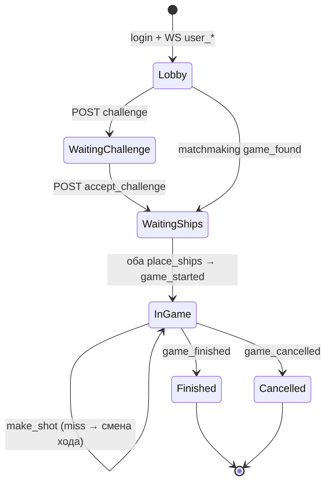

# WARSHIP — API для фронтенда

Документ для ИИ-агента / разработчика фронтенда. Описывает **все публичные HTTP-эндпоинты** и **real-time события Centrifugo**, необходимые для полной интеграции с бэкендом.

---

## 0. Быстрый старт (что реализовать)

### Архитектура

```
Фронтенд
  ├─ HTTP REST  →  /api/...           (действия: логин, матчмейкинг, ходы)
  └─ WebSocket  →  Centrifugo :8001   (события: игра найдена, выстрел, конец игры)
```

**Правило:** пользователь **инициирует действия через HTTP**, а **обновления UI получает через Centrifugo** (и при необходимости дублирует через HTTP polling `GET /status/` и `GET /board/`).

### Базовые URL (локальная разработка)

| Сервис | URL |
|--------|-----|
| REST API | `http://localhost:8000/api` |
| Centrifugo WS | `ws://localhost:8001/connection/websocket` |

### Авторизация всех игровых запросов

```http
Authorization: Bearer <access_jwt>
Content-Type: application/json
```

JWT живёт **1 день** (`access`), refresh — **28 дней**. Обновление: `POST /api/auth/jwt/refresh/`.

### Минимальный порядок интеграции экранов

1. **Регистрация / логин** → сохранить `access`, `refresh`, `user.id`
2. **Подключить Centrifugo** → `GET /api/warship/centrifugo/token/` → подписаться на `user_{user_id}`
3. **Лобби / матчмейкинг** → `POST /api/warship/matchmaking/find/`
4. **Экран игры** → подписаться на `game_{game_id}`, `POST place_ships`, цикл `GET board` + `POST make_shot`
5. **Выход** → `POST /api/warship/game/{id}/leave/` + отписаться от канала игры

---

## 1. Аутентификация

### 1.1. Регистрация по телефону (OTP)

**Шаг 1 — запрос звонка / OTP**

```http
POST /api/auth/otp/request/
```

```json
{ "phone": "+79001234567" }
```

Ответ `200`:

```json
{
  "message": "На ваш номер поступит звонок. Введите последние 4 цифры номера.",
  "is_new_user": true
}
```

> Алиасы (обратная совместимость): `POST /api/auth/register/request-otp/`

**Шаг 2 — подтверждение OTP + установка пароля**

```http
POST /api/auth/otp/confirm/
```

```json
{
  "phone": "+79001234567",
  "code": "1234",
  "password": "secret123"
}
```

Ответ `201`:

```json
{
  "access": "<jwt>",
  "refresh": "<jwt>",
  "message": "Номер успешно привязан!",
  "user": { "id": 1, "phone": "+79001234567" }
}
```

> Алиас: `POST /api/auth/register/confirm-otp/`

### 1.2. Логин по паролю

```http
POST /api/auth/login/
```

```json
{
  "login": "+79001234567",
  "password": "secret123"
}
```

`login` — телефон **или** `username`.

Ответ `200`:

```json
{
  "access": "<jwt>",
  "refresh": "<jwt>",
  "user": { "id": 1, "phone": "+79001234567" }
}
```

### 1.3. Сброс пароля

**Запрос OTP:**

```http
POST /api/auth/password/reset/request/
```

```json
{ "phone": "+79001234567" }
```

**Подтверждение + новый пароль:**

```http
POST /api/auth/password/reset/confirm/
```

```json
{
  "phone": "+79001234567",
  "code": "1234",
  "password": "newsecret123"
}
```

### 1.4. Обновление JWT

```http
POST /api/auth/jwt/refresh/
```

```json
{ "refresh": "<refresh_jwt>" }
```

Ответ: `{ "access": "<new_access>" }` (формат simplejwt).

### 1.5. Логин бота (отдельный клиент, не основной UI)

```http
POST /api/auth/bot/login/
```

```json
{ "token": "<bot_uuid_token>" }
```

Ответ `200`:

```json
{
  "access": "<jwt>",
  "refresh": "<jwt>",
  "user_bot": { "id": 1, "name": "MyBot", "description": "..." }
}
```

**Важно для фронта:**
- JWT бота содержит claim `is_bot: true` и `user_id` **владельца** (человека).
- Бот **не может** вызывать эндпоинты с `@deny_bot` (профиль, CRUD ботов).
- В матчмейкинге бот автоматически играет training-игры (`is_training: true` в теле запроса).

---

## 2. Профиль пользователя

Все эндпоинты ниже требуют `Authorization: Bearer ...`.

### 2.1. Текущий пользователь

```http
GET /api/user/me/
```

Ответ `200`:

```json
{
  "id": 1,
  "phone": "+79001234567",
  "username": "+79001234567",
  "phone_pending": null,
  "first_name": "",
  "last_name": "",
  "email": ""
}
```

`phone_pending` — номер, ожидающий подтверждения OTP.

### 2.2. Обновление профиля

```http
PUT /api/user/me/
```

```json
{
  "username": "captain",
  "first_name": "Ivan",
  "last_name": "Petrov",
  "email": "a@b.c",
  "phone": "+79007654321",
  "password": "newpass"
}
```

Все поля опциональны (partial update). При смене `phone` отправляется OTP — нужен шаг 2.3.

Ответ `200`:

```json
{
  "message": "На ваш номер поступит звонок...",
  "user": { /* UserMeSerializer */ }
}
```

> **Бот:** `403` — «Действие недоступно для бота».

### 2.3. Подтверждение нового телефона

```http
POST /api/user/me/confirm-phone/
```

```json
{ "code": "1234" }
```

---

## 3. Боты пользователя (CRUD)

Базовый путь: `/api/user/me/bots/`

| Метод | URL | Описание |
|-------|-----|----------|
| `GET` | `/api/user/me/bots/` | Список ботов |
| `GET` | `/api/user/me/bots/{id}/` | Один бот |
| `POST` | `/api/user/me/bots/` | Создать бота |
| `PUT` | `/api/user/me/bots/{id}/` | Обновить |
| `DELETE` | `/api/user/me/bots/{id}/` | Удалить |

**Создание:**

```http
POST /api/user/me/bots/
```

```json
{
  "name": "Alpha",
  "description": "Test bot"
}
```

Ответ `201`:

```json
{
  "id": 1,
  "name": "Alpha",
  "description": "Test bot",
  "token": "550e8400-e29b-41d4-a716-446655440000"
}
```

**Список / один бот** — те же поля (`id`, `name`, `description`, `token`).

> **Бот-JWT:** все CRUD операции запрещены (`403`).

---

## 4. Игра — обзор и ограничения

### 4.1. Статусы игры (`GameSession.status`)

| Статус | Значение для UI |
|--------|-----------------|
| `waiting_challenge` | Вызов отправлен, ждём принятия |
| `waiting_ships` | Оба игрока в игре, расставляем корабли |
| `player1_turn` | Ход player1 |
| `player2_turn` | Ход player2 |
| `finished` | Игра окончена, есть победитель |
| `cancelled` | Игра отменена (оба офлайн и т.п.) |

### 4.2. Критические бизнес-правила

1. **Одна активная игра на `user_id`** — повторный `matchmaking/find` вернёт `active_game_found`.
2. **Ход** — только игрок, чей `id` == `current_turn.id`.
3. **Попадание** — ход **остаётся** у того же игрока. **Промах** — ход переходит сопернику.
4. **Корабли** — классическая расстановка: `1×4, 2×3, 3×2, 4×1`, поле `10×10`, без касаний (включая диагонали).
5. **Координаты** — `row`, `col` от **0** до **9**.
6. **Presence** — подписка на `game_{id}` + HTTP-запросы к игре продлевают «онлайн». Если оба офлайн > 60 сек после старта игры — игра может быть отменена (`game_cancelled`).

### 4.3. Формат корабля

```json
{
  "size": 3,
  "cells": [[2, 0], [2, 1], [2, 2]]
}
```

Массив для `POST place_ships`:

```json
{
  "ships": [
    { "size": 4, "cells": [[0,0],[0,1],[0,2],[0,3]] },
    { "size": 3, "cells": [[2,0],[2,1],[2,2]] },
    { "size": 3, "cells": [[4,0],[4,1],[4,2]] },
    { "size": 2, "cells": [[6,0],[6,1]] },
    { "size": 2, "cells": [[6,3],[6,4]] },
    { "size": 2, "cells": [[8,0],[8,1]] },
    { "size": 1, "cells": [[9,0]] },
    { "size": 1, "cells": [[9,2]] },
    { "size": 1, "cells": [[9,4]] },
    { "size": 1, "cells": [[9,6]] }
  ]
}
```

Ошибка размещения → `400` `{ "error": "текст" }`.

---

## 5. Матчмейкинг

### 5.1. Найти игру

```http
POST /api/warship/matchmaking/find/
```

Тело (опционально, для ботов):

```json
{ "is_training": true }
```

**Ответ A — уже есть активная игра** `200`:

```json
{
  "action": "active_game_found",
  "status": "success",
  "data": {
    "game_id": 42,
    "status": "waiting_ships",
    "opponent": { "id": 2, "username": "player2" },
    "player1": { "id": 1, "username": "player1" },
    "player2": { "id": 2, "username": "player2" },
    "current_turn": null
  }
}
```

**Ответ B — противник найден сейчас** `200`:

```json
{
  "action": "game_found",
  "status": "success",
  "message": "Противник найден"
}
```

→ Параллельно придёт WS на `user_{id}` (см. §8).

**Ответ C — встал в очередь** `200`:

```json
{
  "action": "search_started",
  "status": "success",
  "message": "Поиск противника начат"
}
```

→ Ждать WS `game_found` на `user_{id}`.

### 5.2. Отменить поиск

```http
POST /api/warship/matchmaking/cancel/
```

```json
{}
```

Ответ:

```json
{
  "action": "search_cancelled",
  "status": "success",
  "message": "Поиск игры отменен"
}
```

### 5.3. Алгоритм UI (матчмейкинг)

```
1. Убедиться: Centrifugo подключён, подписка user_{my_id} активна
2. POST matchmaking/find/
3. switch (response.action):
     active_game_found → перейти на экран игры game_id
     game_found        → дождаться WS или повторить find (получит active_game_found)
     search_started    → показать «поиск...», ждать WS game_found
4. При нахождении игры → subscribe game_{game_id}
5. Кнопка «Отмена» → POST matchmaking/cancel/
```

---

## 6. Вызов другу (challenge)

### 6.1. Бросить вызов

```http
POST /api/warship/challenge/
```

```json
{ "opponent_id": 2 }
```

Ответ `200`:

```json
{
  "game_id": 55,
  "status": "success",
  "game_status": "waiting_challenge",
  "player1": { "id": 1, "username": "player1" },
  "player2": { "id": 2, "username": "player2" }
}
```

Соперник получает WS `challenge_created` на `user_{opponent_id}`.

### 6.2. Принять вызов

```http
POST /api/warship/game/{game_id}/accept_challenge/
```

Ответ `200`:

```json
{ "message": "Вызов принят" }
```

Статус игры → `waiting_ships`. Оба игрока получают WS `game_found`.

---

## 7. Игровые HTTP-эндпоинты

Все требуют JWT. Пользователь должен быть `player1` или `player2`.

### 7.1. Статус игры

```http
GET /api/warship/game/{game_id}/status/
```

```json
{
  "action": "game_status",
  "status": "success",
  "data": {
    "game_id": 42,
    "status": "player1_turn",
    "player1": { "id": 1, "username": "p1", "ships_placed": true },
    "player2": { "id": 2, "username": "p2", "ships_placed": true },
    "current_turn": { "id": 1, "username": "p1" },
    "winner": null,
    "board_size": 10,
    "started_at": "2026-05-21T12:00:00+00:00",
    "finished_at": null
  }
}
```

### 7.2. Состояние доски

```http
GET /api/warship/game/{game_id}/board/
```

```json
{
  "action": "board_state",
  "status": "success",
  "data": {
    "board_size": 10,
    "my_ships": [
      { "size": 4, "cells": [[0,0],[0,1],[0,2],[0,3]], "destroyed": false }
    ],
    "my_shots": [
      { "row": 5, "col": 3, "hit": true, "ship_destroyed": false, "ship_size": 3 }
    ],
    "opponent_shots": [
      { "row": 1, "col": 1, "hit": false, "ship_destroyed": false, "ship_size": null }
    ]
  }
}
```

**UI:**
- Своя сетка — `my_ships` + `opponent_shots` (куда стрелял соперник).
- Сетка противника — только `my_shots` (свои выстрелы; корабли противника **не отдаются**).

### 7.3. Разместить корабли

```http
POST /api/warship/game/{game_id}/place_ships/
```

```json
{ "ships": [ /* см. §4.3 */ ] }
```

Успех `200`:

```json
{
  "action": "place_ships",
  "status": "success",
  "message": "Корабли успешно размещены"
}
```

Когда **оба** расставили — WS `game_started` + `game_status`.

### 7.4. Выстрел

```http
POST /api/warship/game/{game_id}/make_shot/
```

```json
{ "row": 5, "col": 3 }
```

Успех `200`:

```json
{
  "action": "make_shot",
  "status": "success",
  "data": {
    "success": true,
    "hit": true,
    "ship_destroyed": false,
    "ship_size": 3,
    "game_finished": false,
    "winner": null
  }
}
```

При победе:

```json
{
  "data": {
    "success": true,
    "hit": true,
    "ship_destroyed": true,
    "ship_size": 1,
    "game_finished": true,
    "winner": { "id": 1, "username": "p1" }
  }
}
```

Ошибки `400`:

| error | Когда |
|-------|-------|
| `Сейчас не ваш ход` | Не ваш `current_turn` |
| `Игра еще не начата` | status = `waiting_ships` |
| `Игра уже завершена` | status = `finished` |
| `Вы не участник этой игры` | `403` |

### 7.5. Выйти из игры

```http
POST /api/warship/game/{game_id}/leave/
```

```json
{}
```

Ответ:

```json
{
  "action": "game_left",
  "status": "success",
  "message": "Вы вышли из игры"
}
```

После выхода обоих (и офлайн) возможна отмена → WS `game_cancelled`.

---

## 8. Centrifugo (WebSocket)

### 8.1. Подключение

**Шаг 1 — токен:**

```http
GET /api/warship/centrifugo/token/
Authorization: Bearer <access>
```

```json
{ "token": "<centrifugo_connection_token>" }
```

**Шаг 2 — WS-клиент** (библиотека `centrifuge-js` / `centrifuge-python`):

- URL: `ws://localhost:8001/connection/websocket`
- Передать `token` при connect

**Шаг 3 — подписки:**

| Канал | Когда | События |
|-------|-------|---------|
| `user_{user_id}` | Сразу после логина | матчмейкинг, вызовы |
| `game_{game_id}` | Когда известен `game_id` | ходы, статус, конец игры |

`user_id` берётся из JWT claim `user_id` или `GET /api/user/me/`.

### 8.2. Безопасность каналов

Подписка на `game_{id}` проходит через **subscribe proxy** бэкенда — только участники игры. Не-участник получит отказ.

Presence продлевается через:
- подписку / refresh канала игры;
- любой HTTP к `/api/warship/game/{id}/...` (кроме `leave`).

### 8.3. События на канале `user_{user_id}`

#### `game_found`

```json
{
  "action": "game_found",
  "status": "success",
  "data": {
    "game_id": 42,
    "opponent": { "id": 2, "username": "player2" },
    "player1": { "id": 1, "username": "player1" },
    "player2": { "id": 2, "username": "player2" }
  }
}
```

**Действие UI:** сохранить `game_id`, подписаться на `game_{game_id}`, открыть экран игры.

#### `challenge_created`

```json
{
  "action": "challenge_created",
  "game_id": 55,
  "game_status": "waiting_challenge",
  "opponent": {
    "id": 1,
    "username": "player1",
    "stats": {}
  }
}
```

**Действие UI:** показать диалог «Принять вызов?» → `POST accept_challenge`.

### 8.4. События на канале `game_{game_id}`

#### `game_status`

Полный объект статуса (как `GET /status/` → `data`).

#### `game_started`

```json
{
  "action": "game_started",
  "status": "success",
  "data": {
    "game_id": 42,
    "current_turn": { "id": 1, "username": "p1" },
    "started_at": "2026-05-21T12:00:00+00:00"
  }
}
```

#### `shot_result`

```json
{
  "action": "shot_result",
  "status": "success",
  "data": {
    "success": true,
    "hit": false,
    "ship_destroyed": false,
    "ship_size": null,
    "game_finished": false,
    "winner": null
  }
}
```

После выстрела **всегда** следом приходит `game_status` с обновлённым `current_turn`.

#### `game_finished`

```json
{
  "action": "game_finished",
  "status": "success",
  "data": {
    "game_id": 42,
    "winner": { "id": 1, "username": "p1" },
    "finished_at": "2026-05-21T12:30:00+00:00"
  }
}
```

#### `game_cancelled`

```json
{
  "action": "game_cancelled",
  "status": "success",
  "data": {
    "game_id": 42,
    "finished_at": "2026-05-21T12:15:00+00:00"
  }
}
```

---

## 9. Диаграмма жизненного цикла игры



---

## 10. Полный список эндпоинтов

| Метод | Путь | Auth | Описание |
|-------|------|------|----------|
| POST | `/api/auth/otp/request/` | — | Запрос OTP |
| POST | `/api/auth/otp/confirm/` | — | Подтверждение OTP + пароль |
| POST | `/api/auth/login/` | — | Логин |
| POST | `/api/auth/password/reset/request/` | — | Сброс: запрос OTP |
| POST | `/api/auth/password/reset/confirm/` | — | Сброс: новый пароль |
| POST | `/api/auth/bot/login/` | — | Логин бота |
| POST | `/api/auth/jwt/refresh/` | — | Refresh JWT |
| GET | `/api/user/me/` | ✓ | Профиль |
| PUT | `/api/user/me/` | ✓ | Обновить профиль |
| POST | `/api/user/me/confirm-phone/` | ✓ | Подтвердить телефон |
| GET | `/api/user/me/bots/` | ✓ | Список ботов |
| GET | `/api/user/me/bots/{id}/` | ✓ | Один бот |
| POST | `/api/user/me/bots/` | ✓ | Создать бота |
| PUT | `/api/user/me/bots/{id}/` | ✓ | Обновить бота |
| DELETE | `/api/user/me/bots/{id}/` | ✓ | Удалить бота |
| POST | `/api/warship/matchmaking/find/` | ✓ | Найти игру |
| POST | `/api/warship/matchmaking/cancel/` | ✓ | Отменить поиск |
| POST | `/api/warship/challenge/` | ✓ | Вызов игроку |
| POST | `/api/warship/game/{id}/accept_challenge/` | ✓ | Принять вызов |
| GET | `/api/warship/game/{id}/status/` | ✓ | Статус |
| GET | `/api/warship/game/{id}/board/` | ✓ | Доска |
| POST | `/api/warship/game/{id}/place_ships/` | ✓ | Расстановка |
| POST | `/api/warship/game/{id}/make_shot/` | ✓ | Выстрел |
| POST | `/api/warship/game/{id}/leave/` | ✓ | Выход |
| GET | `/api/warship/centrifugo/token/` | ✓ | WS-токен |

> Эндпоинты `/api/warship/centrifugo/proxy/*` — **только для Centrifugo**, фронт не вызывает.

---

## 11. Формат ошибок

**Валидация (serializer):** `400`

```json
{
  "phone": ["ошибка"],
  "non_field_errors": ["Неверный логин или пароль."]
}
```

**Бизнес-ошибка (views):** `400` / `403` / `404`

```json
{ "error": "Сейчас не ваш ход" }
```

**401** — нет / протух JWT.

---

## 12. Чеклист для ИИ-агента (фронт)

- [ ] HTTP-клиент с автоподстановкой `Authorization` и refresh при 401
- [ ] Хранить `user.id`, `access`, `refresh`
- [ ] Centrifugo: connect → subscribe `user_{id}` → on `game_found` subscribe `game_{id}`
- [ ] Не начинать второй матчмейкинг при активной игре
- [ ] Экран расстановки: блокировать до `waiting_ships`, отправить `place_ships` один раз
- [ ] Экран боя: клик по клетке только если `current_turn.id === myUserId`
- [ ] После `make_shot` обновлять UI из WS (`shot_result` + `game_status`) или `GET board`
- [ ] Экран победы/поражения по `game_finished`
- [ ] При unmount / logout: `leave` + unsubscribe `game_{id}`
- [ ] CORS уже открыт (`*`) — достаточно стандартных заголовков

---

## 13. Референс-реализация

Рабочий клиент на Python (можно смотреть логику интеграции):

- `game_client/api_client.py` — синхронный REST
- `game_client/realtime.py` — Centrifugo
- `game_client/app.py` — GUI с полным циклом игры
- `game_client/load_test/player.py` — async-версия для нагрузочного теста

Существующий протокол (частично устарел): `warship/PROTOCOL.md` — при расхождении **источник истины — этот файл и код в `warship/views.py`**.
